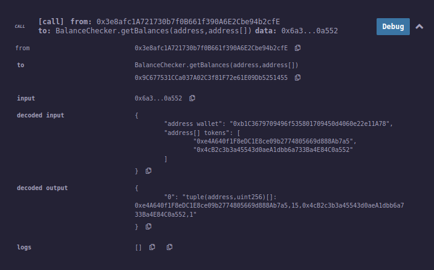

This smart contract is developed on the Remix IDE.

Tested it to be working, by deployed the contract on binance testnet and testing it.

However, I could not get the contract to output the result in the desired format. (array of {token, balance})